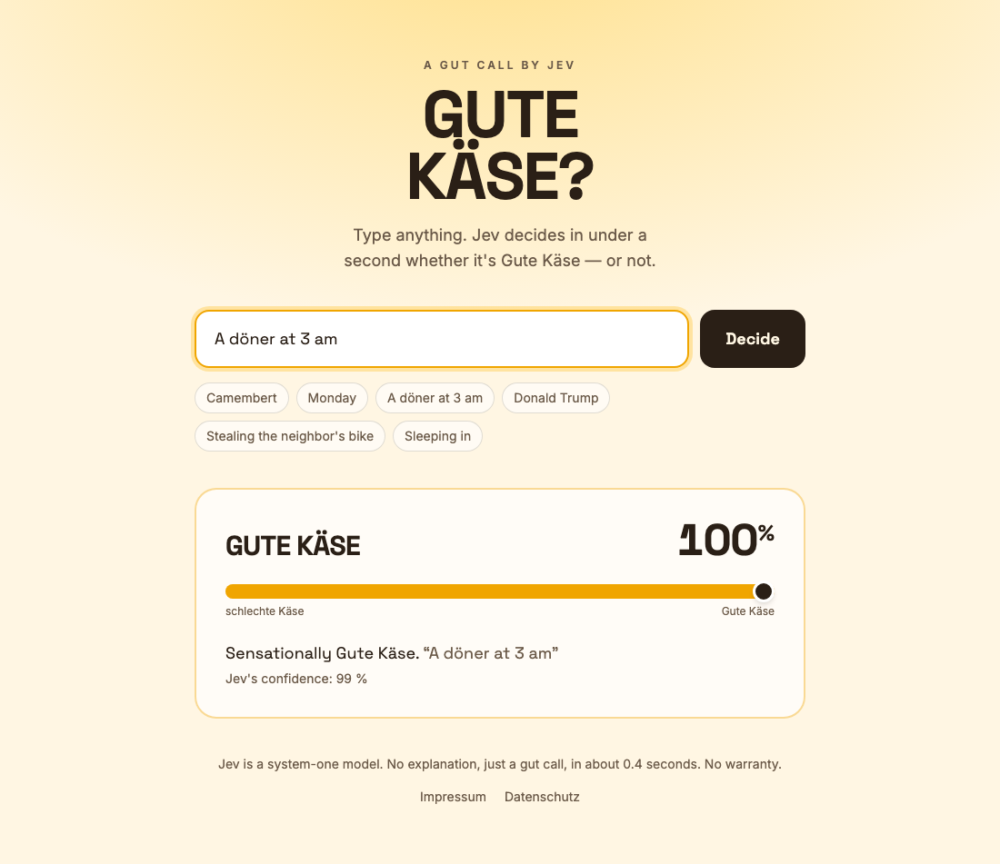

# Gute Käse

Type anything. [Jev](https://docs.typesafe.ai) (TypeSafe AI) decides in about 0.4 seconds whether it is
**Gute Käse** or **schlechte Käse**. Above 50% = Gute Käse, below = schlechte Käse.

A gut call, no explanation. Built for a LinkedIn shitpost.

**Live: https://gute-kaese.vercel.app**



## How it works

- **Jev** is a system-one model. It does not generate text; it answers typed questions with
  probabilities.
- A single yes/no ("Is this Gute Käse?") separates nothing — Jev compresses almost everything to ~40%.
  So the app uses a **score question with five levels and anchor examples**. The score (0–4) is
  normalized to 0–1; 0.5 is the line to good.
- Everything runs server-side in `/api/judge`. The API key never reaches the client.
- The verdict updates as you type (650 ms debounce) or on Enter/button.

The prompt lives in `lib/jev.ts`, the route in `app/api/judge/route.ts`, the UI in `app/page.tsx`.

## Run locally

```bash
pnpm install
cp .env.example .env   # add TYPESAFE_API_KEY (console.typesafe.ai)
pnpm dev               # http://localhost:3000
```

## Deploy (Vercel)

Vercel reads the repo directly, no config needed. Set the key as the environment variable
`TYPESAFE_API_KEY` (Production + Preview).

```bash
vercel            # preview
vercel --prod     # production
```

Or in the Vercel dashboard: "Add New Project" → import the repo → set the env var → Deploy.

## Limits

- No share link, no image card, no accounts, no database.
- Simple best-effort in-memory rate limit per IP, inputs up to 2000 characters.
- Jev is not officially tested on German; the prompt still gives usable results.
- Jev can be manipulated by cleverly worded input. Fine for a toy.